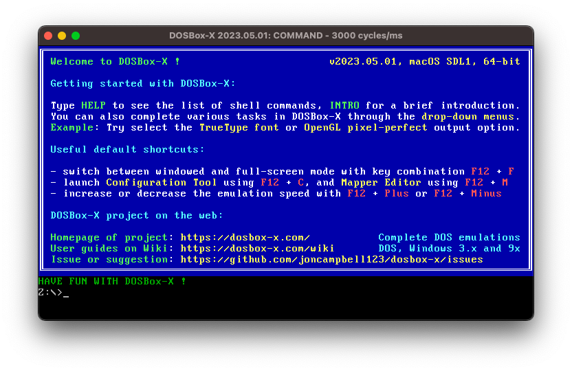
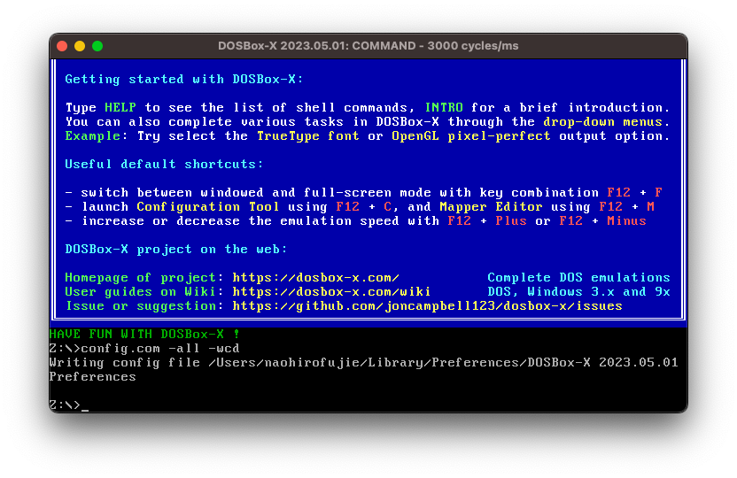
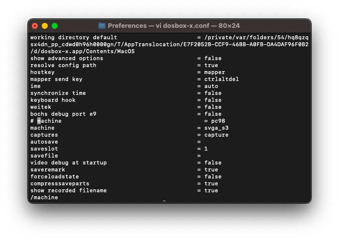
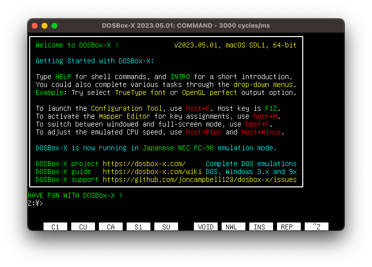
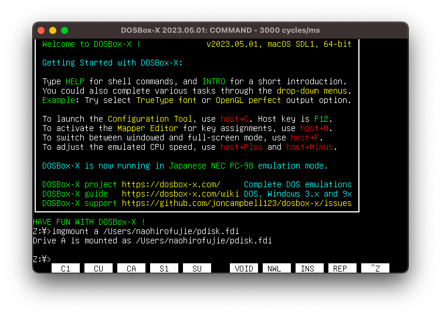
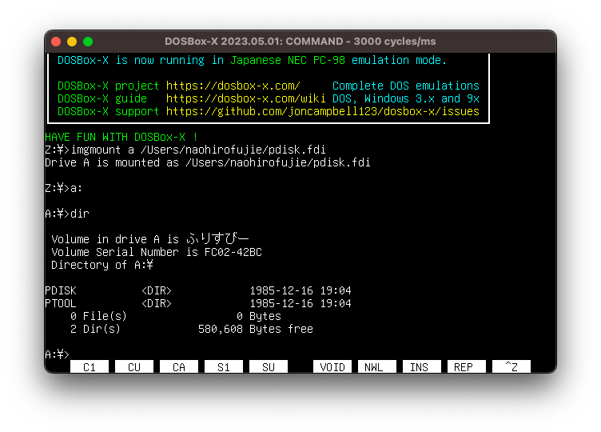
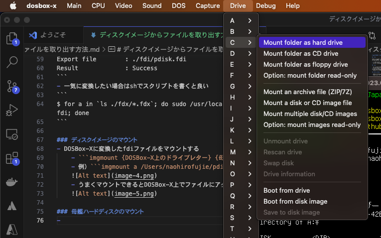
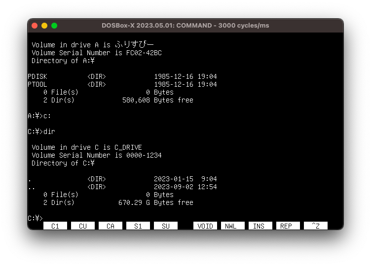
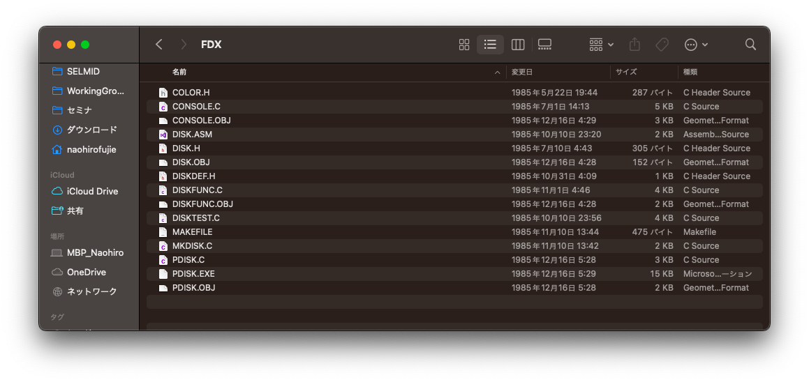

# ディスクイメージからファイルを取り出す方法

## 概要

FDX68 などでイメージ化したフロッピーディスクの中に入っているファイルの取り出しを行う.
ざっくりいうと, DOS エミュレータである DOSBox-X の以下の機能を利用する.

- ローカルフォルダをエミュレータ内のハードディスクとしてマウントする機能
- FD イメージをエミュレータ内の FDD へマウントする機能

## 前提

- FD のファイルシステムは MS-DOS フォーマットであること
- FD イメージの形式は fdi 形式であること(d88 形式でもマウントできるがシリンダ数など手動で指定する必要があり面倒くさい)
- DOSBox-X を PC9801 モードで起動すること

## 準備物/必要物

- DOSBox-X(手元では Intel-based Macbook Pro で試した)
- FDX68 に付属の fdxconv など fdx, d88 などのイメージを fdi 形式に変換するためのツール

## 手順

### DOSBox-X の準備

- [ここ](https://dosbox-x.com/)からダウンロードできる
- PC98 モードにするためには DOSBox-X を起動後、設定ファイルの Export〜編集を行う必要がある
  - 起動する
    
  - `config.com -all -wcd`で設定ファイルを配信する
    
  - ファイルが出力されるので編集する
    - `machine = svga_s3`となっている行を`machine = pc98`に変更する
      
    - ファイル名を`dosbox-x.conf`に変更する
  - DOSBox-X を再起動し`DOSBox-X is now running in Japanese NEC PC-98 emulation mode.`と表示されていれば成功
    

### ディスクイメージの準備

- [FDX68](http://retropc.net/gimons/fdx68/)に含まれる`fdxconv`コマンドを利用する
- 現状、Windows マシンもしくは Raspberry pi でのみ動作するコマンドなので環境に応じてモジュールをセットアップする
- 変換する

```
$ sudo /usr/local/bin/fdxconv -i ./fdx/pdisk.fdx -o ./fdi/pdisk.fdi
FDX68 version 2.00(May 23 2023, 18:21:08)
Powered by XM6 TypeG Technology / Copyright (C) 2017-2023 GIMONS
Floppy image convert utility

Input file         : ./fdx/pdisk.fdx
DIsk Type          : 2D
Name               : pdifk.fdx
Cylinders          : 42
Heads              : 2
Rate               : 500 kbps
RPM                : 300
Write Protect      : ON

Export file        : ./fdi/pdisk.fdi
Result             : Success
```

- 一気に変換したい場合は sh でスクリプトを書くと良い

```
$ for a in `ls ./fdx/*.fdx`; do sudo /usr/local/bin/fdxconv -i $a -o ./fdi/${a%.*}.fdi; done
```

### ディスクイメージのマウント

- DOSBox-X に変換した fdi ファイルをマウントする
  - `imgmount {DOSBox-X上のドライブレター} {母艦のfdiファイル名}`
  - 例）`imgmount a /Users/naohirofujie/pdisk.fdi`
    
  - うまくマウントできると DOSBox-X 上でファイルにアクセスできるようになる
    
- 注意点) 母艦側のフォルダのパスに日本語が含まれていると NG

### 母艦ハードディスクのマウント

- DOSBox-X のメニューの`Drive`よりドライブを選択、`Mount folder as hard drive`でマウントするフォルダを選択する
  
- ドライブにローカルのフォルダがマウントされる
  
- 注意点) 母艦側のフォルダのパスに日本語が含まれていると NG

### FD ドライブからファイルをコピーする

- マウントしたディスクイメージから母艦ハードディスクへファイルをコピーする
- `xcopy`コマンドでフォルダ構造を含めコピーするのが便利(/E でからのサブフォルダごとコピー)
- ` xcopy a:/* c: /E`
- 母艦のフォルダを見るとファイルがコピーされていることがわかる
  
- 注意点) パス名は 8 文字までとなるので母艦側でサブフォルダを作る場合は注意(8 文字以上だと DOSBox-X 側からは見えない)
